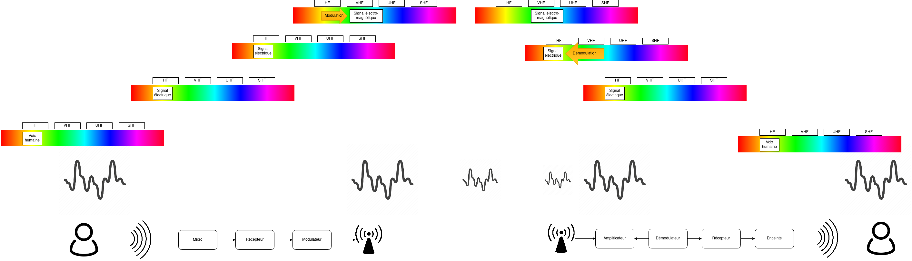
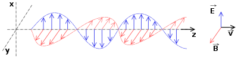
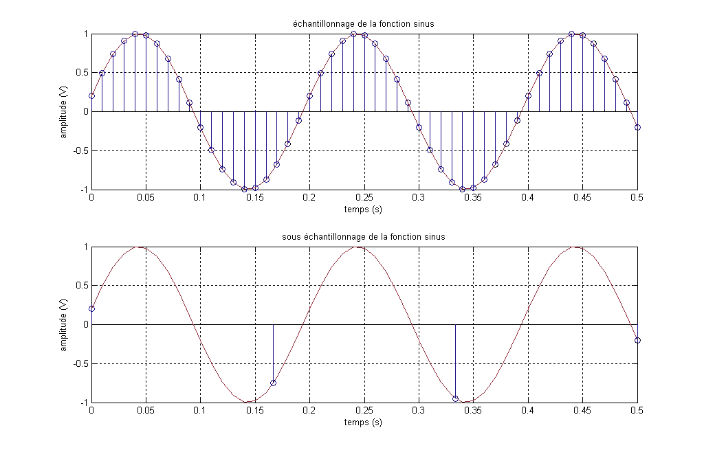
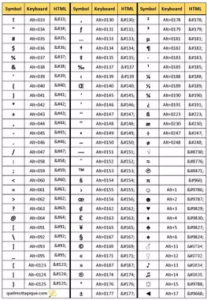

= Signaux
:author: Dhrions
:toc:
:toclevels: 4
:sectnums:

== Transmission d'un signal analogique

Partons de la gauche vers la droite :

. Un individu A parle. Il produit donc du bruit. Ce bruit n'est rien  d'autre qu'une variation de la pression. On pourrait la mesure en hectopascals. Si l'on plaçait un capteur de pression à proximité de cette personne, on obtiendrait le signal représenté au-dessus de la personne. La fréquence de la voie humaine oscille entre 80 et 1500 Hz (cf. https://fr.wikipedia.org/wiki/Voix_humaine#M%C3%A9canismes_vocaux[Wikipédia]).
. Le microphone n'est qu'un simple capteur de pression qui va capteur cette différence de pression au cours du temps et la convertir en un signanl électrique.
NOTE:: Un signal électrique produit aussi nécessairement un signal électromagnétique. C'est la grande découverte de https://fr.wikipedia.org/wiki/Michael_Faraday[Michael Faraday]. Par conséquent, il est possible, à distance, d'intercepter le signal magnétique, d'en déduire le signal électrique et dont l'information qui transite, et ce, tout au long du parcours du signal, d'où l'appellation parfois de « signaux parasites compromettants » (voir https://fr.wikipedia.org/wiki/TEMPEST[TEMPEST] sur Wikipédia).
. Le signal est enregistré par un récepteur.
. Le signal est ensuite modulé. Pourquoi ?
* Interférences : le signal a actuellement une fréquence comprise en 80 et 1500 Hz (donc un écart, on dit une « bande passante », de 1500 Hz), correspondant à celui de la voix humaine. Or, si tout le monde émet ainsi le signal capté, les signaux interféreraient les uns avec les autres. Il est donc nécessaire que chaque signal utilise un canal de transmission (large de 1500 Hz pour la voie humaine) différent. Ainsi, si l'on a un émetteur A et un émetteur B communiquant dans la même zone, le premier modulera ces fréquences de +1000 Hz (entre 1080 et 2500 Hz) et le second de +2000 Hz (etre 2080 et 3500 Hz), par exemple.
* Antennes : la longueur des antennes dépend directement de la fréquence. Plus les fréquences sont hautes, plus les antennes peuvent être petites (cas des satellites qui ont besoin d'antennes miniaturisées et utilisent la gamme SHF) ; plus les fréquences sont basses, plus les antennes peuvent être longues (cas des sous-marins qui laissent traîner dans leur sillage de longues antennes et utilisent la gamme VLF).
* Propagation : les ondes électromagnétiques n'ont pas les mêmes propriétés physiquemes en fonctiondes gammes de fréquences. Ainsi, les ondes de la gamme HF rebondissent sur la ionosphère, ce qui n'est pas le cas des ondes de la gamme VHF. Cela permet ainsi, dans le cas de la HF, de jouer avec les rebonds et de propager des signaux sur des milliers de kilomètres.
+

+
. L'antenne émet le signal électrique selon une certaine polarisation.
. Le signal est ensuite transmis dans les airs. Le signal n'a pas besoin de support physique pour voyage (sans quoi les communications avec la station spatiale internationale ne seraient pas possibles).
Dans les airs, le signal croise évidemment des milliers et des milliers d'autres signaux qui n'interfèrent en rien sa progression.
S'agissant des interférences, le chemin importe moins que l'endroit où l'on reçoit le signal.
Au cours du trajet, le signal s'atténue et devient de moins en puissant.
+

+
. L'antenne de réception doit avoir une longueur convenable qui doit lui permettre de bien réceptionner le signal en fonction de sa fréquence (voir _supra_).
Le signal électromagnétique reçu par l'antenne induit un courant électrique dans celle-ci.
. Le signal s'étant atténué, il doit être amplifier.
On augmente ainsi ce que l'on appelle le « gain » du signal.
. À rebours de ce qui a été fait à l'envoi, le signal doit maintenant être démodulé pour revenir à sa fréquence d'origine.
. Le signal électrique peut maintenant à nouveau être converti en un signal mécanique, à savoir du bruit.

== Transmission numérique

=== Transmission d'un signal numérique

Le processus est globalement le même que précédemment.

=== Échantillonnage

Seulement, cette fois-ci, le récepteur échantillonne le signal.
C'est-à-dire qu'à un certain intervalle (toutes les 15 millisecondes par exemple), il va mesurer la valeur de la pression.

On aboutit donc à une liste de mesures de la pression à un certain intervalle (exemple : 30,50,50,80,56,95,42...).
On peut faire le choix d'être plus ou moins sur la fréquence d'échantillonnage : plus le récepteur va procéder souvent à des échantillonnages, plus il y aura de données, et inversement.
On peut faire le choix d'être plus ou moins fin sur la précision de la mesure.
Pour la voix, par exemple, on peut ranger chaque mesure de pression dans une liste de 100 valeurs (0 Hpa, 10 Hpa, 20 HPa... 10000 HPa) ou de 1000 valeurs (0 Hpa, 1 HPa, 2 Hpa... 10000 HPa).
Plus on choisira de valeurs, plus le signal sera échantillonné avec précision.

Ces deux choix : échantillonnage et échelle de valeurs doivent répondre à un compromis entre la reproduction fidèle du signal d'origine (qualité) et le coût de transmission de ce signal (plus l'on est précis, plus il faudra communiquer d'information, plus cela demandera du temps, de la bande passante et _in fine_ de l'argent).

Le https://fr.wikipedia.org/wiki/Th%C3%A9or%C3%A8me_d'%C3%A9chantillonnage[théorème de Nyquist-Shannon] et d'autres découvertes ultérieures permettent de trouver de faire des choix optimaux en fonction du choix humain.
Car dans tous les cas, le compromis qui doit être trouvé dépend d'un choix humain.

La liste de valeurs obtenues (exemple : 30,50,50,80,56,95,42...) est convertie en base binaire (exemple : 11110, 110010, 110010, 1010000, 111000, 1011111, 101010...).
Maintenant, le problème est le suivant : lorsque le récepteur recevra cette suite de nombres binaires (exemple : 11110, 110010, 110010, 1010000, 111000, 1011111, 101010...), il pourra les convertir facilement en base décimale (exemple : 30,50,50,80,56,95,42...), cependant, comment fait-il pour les interpréter ?
C'est là qu'il est important que l'émetteur et le destinataire ait convenu d'un *code* au préalable.

=== Codage

En effet, encore faut-il que le destinataire sache que l'émetteur va lui envoyer une suite de nombre et que chaque nombre va correspondre à l'ordonnée du signal reçu.

On peut prendre l'exemple du Morse. Si je reçois une communication avec des points et des traits sans connaître l'existence même du Morse, je ne peux pas comprendre la signification de ces caractères.
En revanche, si on me fournit une table d'équivalence (trois points signifient « S » et trois traits « O », etc.), je vais pouvoir *décoder*.

WARNING: Il ne peut y avoir de code sans table d'équivalence.

C'est ainsi que fonctionne les codes public comme le code Morse.

Ou comme le code ASCII.

Ou comme les codes secrets tel le https://fr.wikipedia.org/wiki/Chiffre_des_francs-ma%C3%A7ons[chiffre des francs_maçons].

image:https://upload.wikimedia.org/wikipedia/commons/d/d2/Pigpen_for_Wikipedia.png[title=Par Original téléversé par Dake sur Wikipédia français. — Transféré de fr.wikipedia à Commons., FAL, https://commons.wikimedia.org/w/index.php?curid=2347090]

=== Transmission d'un fichier numérique