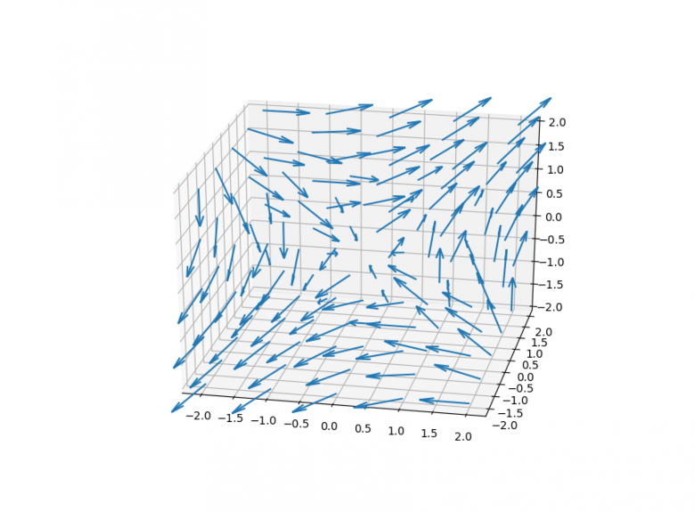
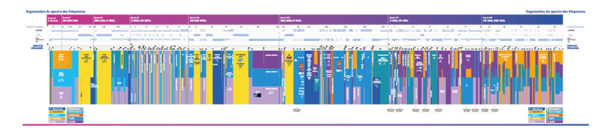
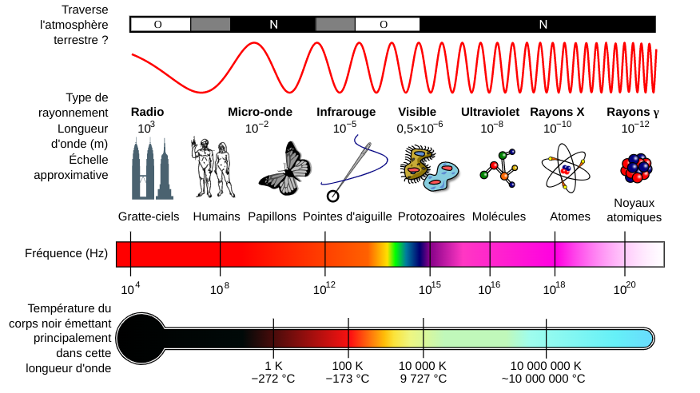
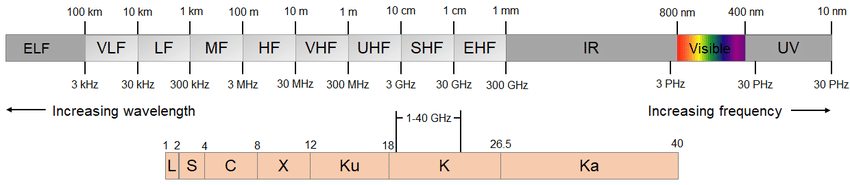

= Les signaux pour les nuls
:author: Dhrions
:toc:
:toclevels: 4
:sectnums:

== Le spectre électromagnétique

=== L'environnement électromagnétique ou la 5e dimension

Nous évoluons dans un monde en 3 dimensions.
Certains ajoutent que le temps est la 4e dimension.
Dans ce cas, la 5e dimension pourraient être le champ électromagnétique.
De même que l'on peut parcourir un champ de blé ou champ de maïs (en 2 dimensions en l'occurrence, avec une surface courbée), on peut parcourir le champ électromagnétique.

=== Le champ électromagnétique

Chaque point, chaque micropoint, chaque nanopoint de l'espace est affecté par un champ électromagnétique.
C'est-à-dire qu'une chaque point de l'espace, sur Terre et dans l'espace, une force électrique et une force magnétique s'exercent, en chaque point de l'espace, si l'on observe une particule chargée électriquement (par exemple : un électron), on pourrait voir qu'elle est animée par une force qui l'amène à se mouvoir jusqu'à une nouvelle position.
Et à cette nouvelle position, elle est à nouveau mue par une nouvelle force électrique qui la meut vers une nouvelle position, et ainsi de suite.

Si l'on regarde l'image ci-dessous, une particule chargée, située à la base d'une flèche, finirait à la pointe de la flèche.
Arrivée à la pointe d'une flèche, elle serait à la base d'une autre flèche, qui l'emmenèrait à sa pointe et ainsi de suite...

Les trois premières dimensions nous servent à transporter de la matière (transports divers et variés), de l'énergie (transport de matières premières...) et de l'information (transport de documents sous forme de documents écrits, de clés USB...).
La dimension électromagnétique ne permet pas de transporter de la matière.
En revanche, elle permet de transporter de l'énergie (exemples : recharge de certains téléphones à distance, four à micro-ondes, lasers...) mais aussi et surtout de l'information (communication par les ondes radio-électriques : radio, Wifi, satellites de télécommunications...).

De même qu'un observateur peut faire, dans les 3 premières dimensions, ce que certains militaires appellent un « tour d'horizon », c'est-à-dire de se mettre sur un point haut, et de lister les points remarquables (et les directions et distances associées) de 0 à 360°, il est également possible de faire un tour d'horizon électromagnétique et de lister tous les signaux qu'ils est possible d'intercepter de 0 à X GHz.

C'est notamment un des rôles dévolus en France à l'https://www.anfr.fr[ANFR] afin de s'assurer que tous les utilisateurs de fréquences (à commencer par vous qui utilisez un téléphone portable) respectent bien les fréquences fixées par l'ANFR.
Et l'ANFR elle-même se réfère aux conventions de l'https://fr.wikipedia.org/wiki/Union_internationale_des_t%C3%A9l%C3%A9communications[Union internationale des télécommunications].

=== Découpage du spectre électromagnétique

Chaque portion du spectre électromagnétique a été découpée par cette organisation afin de s'assurer que le monde entier se coordonne sur la manière d'utiliser ce spectre électromagnétique.

On peut consulter la répartition des fréquences du spectre électromagnétiques en France sur le site de l'ANFR à https://www.anfr.fr/anfr/cest-quoi-le-spectre-des-frequences[cette adresse].

On peut voir ci-dessous une répresentation du spectre électromagnétique.
C'est l'occasion de vous rappeler (ou de vous apprendre) que la lumière est une onde électromagnétique tout comme les ondes radios ou les micro-ondes de votre four.
La principal spécificité de cette onde électromagnétique qu'est la lumière... c'est qu'on la voit.

Le spectre électromagnétique peut-être divisé en plusieurs catégories aux fréquences croissantes :

* les ondes radio-électriques ;
* les micro-ondes ,
* l'infrarouge (_infra_, sous en latin, sous la fréquence du rouge) ;
* la lumière visible (par les humains) ;
* l'ultraviolet (_ultra_, au-delà en latin, au-delà de la fréquence du violet) ;
* les rayons X ;
* les rayons gamma.

Alors même que toutes ces ondes ont des usages très différents dans notre quotidien (communiquer, voir, chauffer des aliments, faire des radios...), elles ne sont en réalité que les émanations d'un seul et même phénomène : l'onde électromagnétique.
Qui aurais-pu l'affirmer il y a plus de deux cents ans ?
Mais qui, après avoir passé plus de quinze ans à l'école, en est pleinement conscient aujourd'hui ?

Si le spectre électromagnétique tout entier a été divisé en différentes portions, la portion des ondes radios elle-même peut être divisée à son tour.

=== Gammes de fréquences

On a divisé les ondes radios en plusieurs « gammes », qui sont, des fréquences les moins élevées au plus élevées les différentes gammes représentées ci-dessous (ELF, VLF, LF...).

Les différentes gammes ont des particularités.

==== Taille d'antenne

La longueur des antennes dépend directement de la fréquence.
Plus les fréquences sont hautes, plus les antennes peuvent être petites (cas des satellites qui ont besoin d'antennes miniaturisées et utilisent la gamme SHF) ; plus les fréquences sont basses, plus les antennes peuvent être longues (cas des sous-marins qui laissent traîner dans leur sillage de longues antennes et utilisent la gamme VLF).

==== Débit d'information

Plus une fréquence est basse, moins on peut communiquer d'information rapidement, plus une fréquence est haute, plus on peut communiquer d'information rapidement.
Pour le coup, la signification scientifique de « fréquence » est proche de son acception quotidienne.
Si je demande à Alice et à Bob de me lire _Les Misérables_, qu'Alice n'a droit qu'a un mot par seconde (soit une fréquence d'un hertz) et que Bob en a droit à deux mots par secondes (soit une fréquence de deux hertz), qui m'aura lu le plus long passage en l'espace d'une minutes ?
Par conséquent, plus la fréquence d'un signal est élevé, plus le débit *théorique* qu'il peut transmettre est important.

Je dis bien théorique car les ondes ont des propriétés de propagation différentes qui peuvent faire qu'une fréquence élevée ne vous sert à rien si elle n'arrive pas à destination alors qu'une autre fréquence, moins élevée, arrive, elle, à bon port.

==== Propagation

Les ondes radios n'ont pas toutes les mêmes propriétés en fonction de leur fréquence.
Ainsi, les ondes de la gamme HF rebondissent sur la ionosphère, ce qui n'est pas le cas des ondes de la gamme VHF.
Cela permet ainsi, dans le cas de la HF, de jouer avec les rebonds et de propager des signaux sur des milliers de kilomètres.
Encore faut-il savoir sur quelle couche de la ionosphère ces ondes vont rebondir.
Il existe pour cela des logiciels qui calculent en fonction de la position géographique de l'émetteur, de la date et de l'heure, où les ondes HF rebondiront.
C'est ce qui permet notamment aux radio-amateurs de communiquer à travers le monde.
Les rebonds sont tels qu'il est possible de communiquer aux antipodes.

image::rebond.png[width=400, align=center]

== Transmission d'un signal analogique

Pour décrire la transmission d'un signal analogique, prenons le cas d'un individu A qui appelle un indivdu B.
Je vous propose d'afficher en plus grand l'image ci-dessous et de suivre le déroulé avec l'image à côté.

image::analogic-transmission.png[]

Nous partons de la gauche vers la droite.

=== Captation du bruit

Un individu A parle. Il produit donc du bruit. Ce bruit n'est rien  d'autre qu'une variation de la pression. On pourrait la mesure en hectopascals. Si l'on plaçait un capteur de pression à proximité de cette personne, on obtiendrait le signal représenté au-dessus de la personne. La fréquence de la voie humaine oscille entre 80 et 1500 Hz (cf. https://fr.wikipedia.org/wiki/Voix_humaine#M%C3%A9canismes_vocaux[Wikipédia]).

Le microphone n'est qu'un simple capteur de pression qui va capter cette différence de pression au cours du temps et la convertir en un signal électrique.

NOTE:: Un signal électrique produit aussi nécessairement un signal électromagnétique. C'est la grande découverte de https://fr.wikipedia.org/wiki/Michael_Faraday[Michael Faraday]. Par conséquent, il est possible, à distance, d'intercepter le signal magnétique, d'en déduire le signal électrique et dont l'information qui transite, et ce, tout au long du parcours du signal, d'où l'appellation parfois de « signaux parasites compromettants » (voir https://fr.wikipedia.org/wiki/TEMPEST[TEMPEST] sur Wikipédia).

Le signal est ensuite enregistré par un récepteur.

=== Modulation

Le signal est ensuite modulé. Pourquoi ?
* Interférences : le signal a actuellement une fréquence comprise en 80 et 1500 Hz (donc un écart, on dit une « bande passante », de 1500 Hz), correspondant à celui de la voix humaine.
Or, si tout le monde émet ainsi le signal capté, les signaux interféreraient les uns avec les autres.
Il est donc nécessaire que chaque signal utilise un canal de transmission (large de 1500 Hz pour la voie humaine) différent.
Ainsi, si l'on a un émetteur A et un émetteur B communiquant dans la même zone, le premier modulera ces fréquences de +1000 Hz (entre 1080 et 2500 Hz) et le second de +2000 Hz (etre 2080 et 3500 Hz), par exemple.
Le besoin de segmenter le spectre électromagnétique est intervenu très tôt dans l'histoire des télécommunications puisque la plus ancienne organisation intergouvernementale technique de coordination n'est autre que l'Union internationale du télégraphe en 1865, qui a été renommée en https://fr.wikipedia.org/wiki/Union_internationale_des_t%C3%A9l%C3%A9communications[Union internationale des télécommunications] en 1932.
À ce titre, elle est justement « chargée de la réglementation et de la planification des télécommunications dans le monde. » 
* Antennes : la longueur des antennes dépend directement de la fréquence (voir <<Taille d'antenne, _supra_>>)).
* Propagation : les ondes électromagnétiques n'ont pas les mêmes propriétés physiquemes en fonction des gammes de fréquences.
On peut préférer utiliser certaines ondes plutôt que telles autres en raison de leurs propriétés de propagation spécifiques (voir <<Propagation, _supra_>>).

=== Emission et propagation

L'antenne émet le signal électrique selon une certaine polarisation.

Le signal est ensuite transmis dans les airs. Le signal n'a pas besoin de support physique pour voyage (sans quoi les communications avec la station spatiale internationale ne seraient pas possibles).
Dans les airs, le signal croise évidemment des milliers et des milliers d'autres signaux électromagnétiques (comme la lumière) qui ne perturbent en rien sa progression.
S'agissant des interférences, le chemin importe moins que l'endroit où l'on reçoit le signal.
Au cours du trajet, le signal s'atténue et devient de moins en puissant.

image::onde_electromagnetique.png[width=400]

=== Réception

L'antenne de réception doit avoir une longueur convenable qui doit lui permettre de bien réceptionner le signal en fonction de sa fréquence (voir _supra_).
Le signal électromagnétique reçu par l'antenne induit un courant électrique dans celle-ci.

Le signal s'étant atténué, il doit être amplifier.
On augmente ainsi ce que l'on appelle le « gain » du signal.

À rebours de ce qui a été fait à l'envoi, le signal doit maintenant être démodulé pour revenir à sa fréquence d'origine.

Le signal électrique peut maintenant à nouveau être converti en un signal mécanique, à savoir du bruit.

== Transmission numérique

=== Transmission d'un signal numérique

Le processus est globalement le même que précédemment.

=== Échantillonnage

Seulement, cette fois-ci, le récepteur échantillonne le signal.
C'est-à-dire qu'à un certain intervalle (toutes les 15 millisecondes par exemple), il va mesurer la valeur de la pression.

image::Echantillonnages_sinus.png[width=500, align="center"]

On aboutit donc à une liste de mesures de la pression à un certain intervalle (exemple : 30, 50, 50, 80, 56, 95, 42...).
On peut faire le choix d'être plus ou moins fin quant à la fréquence d'échantillonnage : plus le récepteur va procéder souvent à des échantillonnages, plus il y aura de données, et inversement.
On peut également faire le choix d'être plus ou moins fin sur la précision de la mesure.
Pour la voix, par exemple, on peut ranger chaque mesure de pression dans une liste de 1000 valeurs (0 HPa, 10 HPa, 20 HPa... 10000 HPa) ou de 10000 valeurs (0 HPa, 1 HPa, 2 HPa... 10000 HPa).
Plus on choisira de valeurs, plus le signal sera échantillonné avec précision.

Ces deux choix, échantillonnage et échelle de valeurs, doivent répondre à un compromis entre la reproduction fidèle du signal d'origine (qualité) et le coût de transmission de ce signal (plus l'on est précis, plus il faudra communiquer d'information, plus cela demandera du temps, de la bande passante et _in fine_ de l'argent).

Le https://fr.wikipedia.org/wiki/Th%C3%A9or%C3%A8me_d'%C3%A9chantillonnage[théorème de Nyquist-Shannon] et d'autres découvertes ultérieures permettent de faire des choix optimaux en fonction du choix humain.
Car dans tous les cas, le compromis qui doit être trouvé dépend d'un choix humain.

La liste de valeurs obtenues (exemple : 30, 50, 50, 80, 56, 95, 42...) est convertie en base binaire (exemple : 11110, 110010, 110010, 1010000, 111000, 1011111, 101010...).
Maintenant, le problème est le suivant : lorsque le récepteur recevra cette suite de nombres binaires (exemple : 11110, 110010, 110010, 1010000, 111000, 1011111, 101010...), il pourra les convertir facilement en base décimale (exemple : 30, 50, 50, 80, 56, 95, 42...), cependant, comment fait-il pour les interpréter ?
C'est là qu'il est important que l'émetteur et le destinataire ait convenu d'un *code* au préalable.

=== Codage

En effet, encore faut-il que le destinataire sache que l'émetteur va lui envoyer une suite de nombre et que chaque nombre va correspondre à l'ordonnée du signal reçu.

On peut prendre l'exemple du Morse. Si je reçois une communication avec des points et des traits sans connaître l'existence même du Morse, je ne peux pas comprendre la signification de ces caractères.
En revanche, si on me fournit une table d'équivalence (trois points signifient « S » et trois traits « O », etc.), je vais pouvoir *décoder*.

WARNING: Il ne peut y avoir de code sans table d'équivalence.

C'est ainsi que fonctionne les codes public comme le code Morse.

image::International_Morse_Code.svg.png[]

Ou comme le code ASCII.

image::ascii.webp[]

Ou comme les codes secrets tel le https://fr.wikipedia.org/wiki/Chiffre_des_francs-ma%C3%A7ons[chiffre des francs maçons].

image:https://upload.wikimedia.org/wikipedia/commons/d/d2/Pigpen_for_Wikipedia.png[title=Par Original téléversé par Dake sur Wikipédia français. — Transféré de fr.wikipedia à Commons., FAL, https://commons.wikimedia.org/w/index.php?curid=2347090]

=== Transmission d'un fichier numérique
