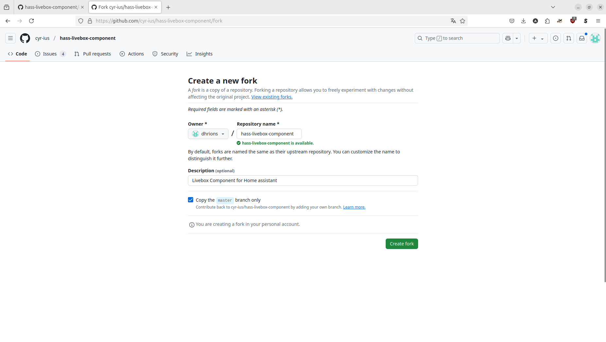

= Github
Dhrions
Version 1.0.0, 08/02/2025
// Document attributes
:sectnums:                                                          
:toc:                                                   
:toclevels: 5  
:toc-title: Ma super table des matières
:icons: font

:description: Example AsciiDoc document                             
:keywords: AsciiDoc                                                 
:imagesdir: ./images
:iconsdir: ./icons
:stylesdir: ./styles
:scriptsdir: ./js

// // Mes variables
// :url-wiki: https://fr.wikipedia.org/wiki
// :url-wiki-Europe-Ouest: {url-wiki}/Europe_de_l%27Ouest

// This is the optional preamble (an untitled section body).
// Useful for writing simple sectionless documents consisting only of a preamble.

== Comment faire pour proposer une modification de code sur Github ?

Par exemple, on se rend compte que cette page, l'icône de NAS n'existe pas :

On pourrait la rajouter.

Pour cela, on fork le dépôt Github.
On se rend sur la page du dépôt et on clique sur le bouton "Fork".
On arrive sur cette page :

On demande le fork et l'on arrive sur cette page :

image::image::forking.png[]

On le clone sur notre machine :

[source,shell]
git clone https://github.com/dhrions/hass-livebox-component.git

On fait les modifications sur notre machine.

On stage, on commite et on push.

On se rend ensuite sur Github et on demande à faire une pull request.

// NOTE:: Le mieux est d'écrire une phrase par ligne.

// == Les listes

// === Listes ordonnées

// .Liste des pays :
// . Premier
// . Deuxième

// === Liste non ordonnées

// * item
// ** nested item
// * item
// * item
// * item
// ** nested item
// ** nested item
// *** subnested item
// ** nested item
// * item

// == Les citations

// // À propos des citations : https://docs.asciidoctor.org/asciidoc/latest/blocks/blockquotes/

// === Basic quote syntax

// [quote,attribution,citation title and information]
// Quote or excerpt text

// .After landing the cloaked Klingon bird of prey in Golden Gate park:
// [quote,Captain James T. Kirk,Star Trek IV: The Voyage Home]
// Everybody remember where we parked.

// === Quoted blocks

// [quote,Monty Python and the Holy Grail]
// ____
// Dennis: Come and see the violence inherent in the system. Help! Help! I'm being repressed!

// King Arthur: Bloody peasant!

// Dennis: Oh, what a giveaway! Did you hear that? Did you hear that, eh? That's what I'm on about! Did you see him repressing me? You saw him, Didn't you?
// ____

// === Quoted paragraphs

// "I hold it that a little rebellion now and then is a good thing,
// and as necessary in the political world as storms in the physical."
// -- Thomas Jefferson, Papers of Thomas Jefferson: Volume 11

// == Les liens

// Pour aller à la section intitulée « <<Les listes>> », c'est par <<Les listes, ici>>.

// Il y a un dossier intéressant : link:./example1[ici].

// == Les variables ({url-wiki-Europe-Ouest}[cf. Wikipédia])

// == Les blocs

// .Voici le titre d'un bloc
// Et là, cela est un bloc, constitué d'une phrase.
// Et d'une deuxième phrase.
// Et d'une troisième.

// == Le code

// [source, python]
// ----
// print("Hello world"!)
// ----

// Je peux facilement inclure une partie d'un fichier de code en-dessous.

// [source, python]
// ----
// include::./example1/python.py[tag=le-nom-de-mon-tag]
// ----

// CAUTION: `include` ne fonctionne pas sur Git Hub.